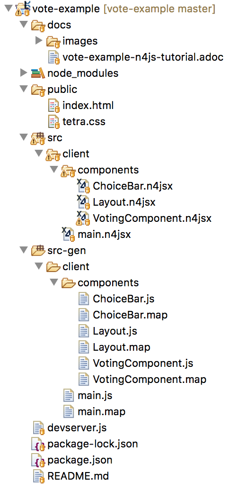
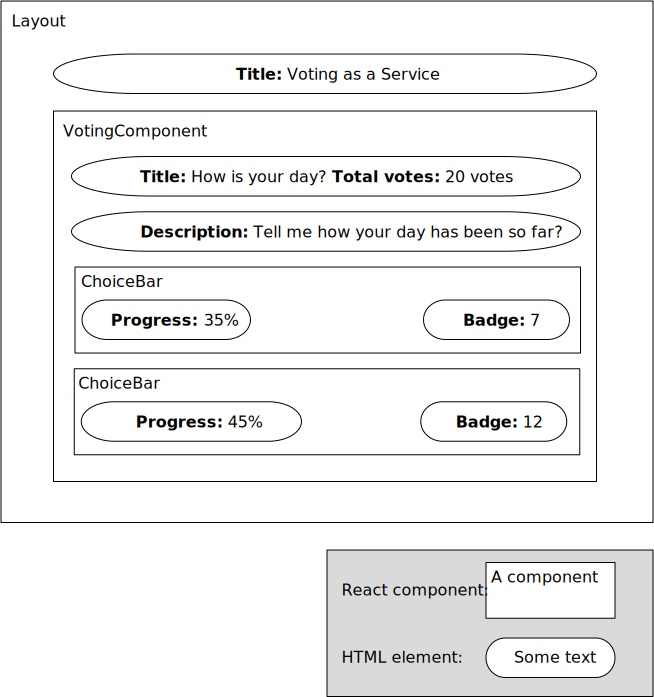
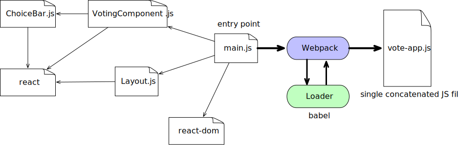
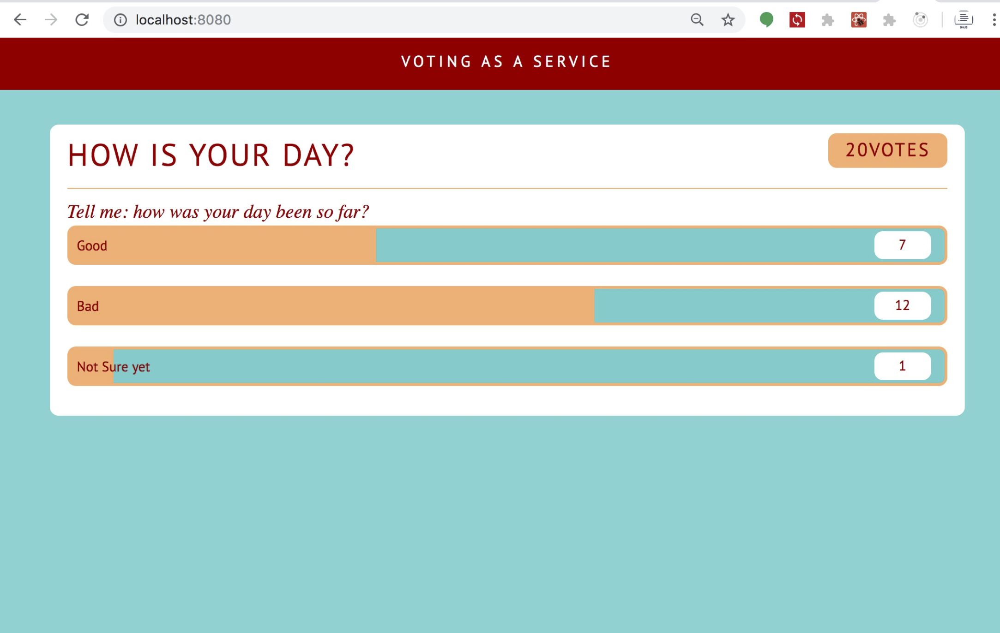

= vote-example

This project implements the link:https://github.com/reactbuch/vote-example[**Vote Example**] from the excellent  book link:https://reactbuch.de/[**React Buch**] (in German) in link:https://www.eclipse.org/n4js/[N4JS]. The project serves as an example demonstrating how to develop a React application in N4JS.

== Developer Setup

Follow these steps to import the app into N4JS IDE.

Step 1: Download the link:https://projects.eclipse.org/projects/technology.n4js/downloads[latest N4JS IDE] for your operating system.

Step 2: The project is already an Eclipse with the `.project` file in the root `vote-example`. Hence, you can simply import it into the N4JS IDE workspace via `File => Import => Existing Projects into Workspace`.

The IDE will complain that npm dependencies declared in `package.json` are missing. Use the quickfix `run npm/yarn in this project` to fix this issue.

Step 3: Open the library manager dialog and choose `Re-Build node_modules`.

Step 4: Clean & Build the project. After this step, the project should has no compilation errors anymore.

== Application structure

The application structure is shown in the N4JS IDE as follows.

[.center]

The folder `public` contains `index.html` and the CSS file used to style the UI.

The `index.html` has the following content

[source,html]
----
<!DOCTYPE html>
<html>
    <head lang="en">
        <meta charset="UTF-8">
        <title>Vote as a Service</title>
        <link rel="stylesheet" href="tetra.css">
    </head>

    <body>
    	<!-- The React vote app is mounted as a child of this div -->
        

    </body>

    <!-- Import the bundled JavaScript file created by the Webpack -->
    
</html>
----

The vote app is mounted as a child element of the `div` of id `voteAppMountPoint`. Moreover, we include the JavaScript file `dist/vote-app.js` bundled by Webpack that contains all the JavaScript file of the app. Of course, for this to work, we have to configure Webpack to output the bundled file into the file `dist/vote-app.js` (this is configured in `webpack.config.js`).

The N4JS code of the application is located inside the folder `src`. Since we are using React with JSX, we use `n4jsx` file extension rather than `n4js`. The root of the application is `main.n4jsx`, in which a root React component `Layout` is instantiated and mounted to the `div` of id `voteAppMountPoint`.

The application UI is a hierarchy of React components mixed with HTML elements as shown in the diagram below.

[[img:react-components]]
[.center]

== Build process

The following diagram shows the build process of the application.

[[img:react-build-process]]
[.center]

The build process of the application makes use of the following tools:

* **Webpack**: a bundler that bundles all JavaScript files into a single JavaScript file called `vote-app.js` which will be embedded in an `index.html` file. In particular, **Webpack** starts at the entry point `main.js` and concatenates all (possible transitively) dependent JavaScript files into a single JS file. Before the concatenation, the files can be preprocessed by _loaders_. We use Babel loader in this application.

* **Babel**: a compiler that transpiles JavaScript and JSX code into backwards compatible version of JavaScript understood by older browsers and environments. You may ask: _N4JS already has a transpiler, why do we need Babel at all?_
The answer is: n4js transpiler does not support transpiling into multiple targets. Instead, it transpiles N4JS code into ES6 code. Consequently, If we want our React application to be runnable on older browsers, we will need Babel to transpile ES6 code into lower code, e.g. ES5, ES3.

For development, we use Webpack Development Server that supports Hot Reloading, i.e. changes during development are reflected immediately in the browser.

The file `webpack.config.js` configures Webpack as well as Webpack Dev Server. In particular, we configure Webpack to use `src-gen/client/main.js` as the entry point to calculate the dependent JavaScript files. Moreover, we configure Webpack to output the resultant bundled JavaScript file into the file `public/dist/vote-app.js`.

=== Run the application

In the root folder of the project `vote-example`, execute the following command to install all dependencies.

[source,bash]
----
npm install
----

In `package.json`, a `start` script for executing `devserver.js` is defined. To start the application, run

[source,bash]
----
npm start
----

The web app is served at port 8080 and should look similar to the following screenshot.

[.center]

# vote-example-redux
