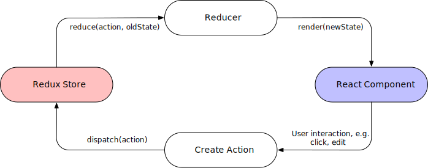
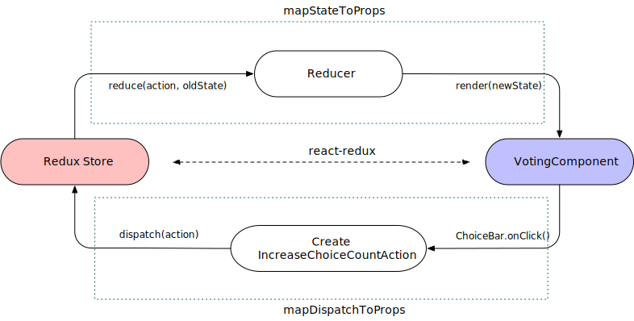

= vote-example-redux

This project implements the link:https://github.com/reactbuch/vote-example[**Vote Example**] from the excellent book link:https://reactbuch.de/[**React Buch**] (in German) in link:https://www.eclipse.org/n4js/[N4JS]. In particular, the project implements the example using React and Redux. This project is part 2 of link:https://github.com/qtran-n4/vote-example[vote-example] so make sure you checkout that project before continue.

== Redux architecture

The key difference between this project `vote-example-redux` and the project link:https://github.com/qtran-n4/vote-example[vote-example] is that while link:https://github.com/qtran-n4/vote-example[vote-example] stores the application state in the `state` variable of React components, this project uses link:https://redux.js.org/[Redux] as a central store for the entire application state.

Redux is an implementation of the Flux architectural concept which strictly allows the data to flow in only one direction as shown in the following diagram.

Since all application states are moved to Redux, React components become pure UI elements without state. In particular, React components simply render the UI using the data retrieved from the Redux store.

The application flow is as follows:

* When a user interaction is triggered on the React component (e.g. button clicked, text field edited etc.), an _action_ is created. The action describes the changes needed to be updated in the application. For instance, when a text field is editted, the action created may contain the new string of the text field.

* The action is _dispatched_ to the Redux store whereby the Redux store stores the application state, usually as a hierarchical tree of state.

* The _reducers_ take the action and the current application state and create an updated application state.

* The updated application state may contain changes that are relevant to certain React components. These changes are forwarded into React components in form of `props`. If a React component's `props` are changed, it is rerendered.

== Example of Redux use in this application

In the implementation without Redux link:https://github.com/qtran-n4/vote-example[vote-example], the React component `VotingComponent` has a `state` variable that stores the count of choices, among other. In this application, we store the count of choices in the Redux store.

The React component `VotingComponent` is connected to the the Redux store with the help of the npm link:https://react-redux.js.org/[react-redux]. For this purpose, we need to define two key methods:

* `mapStateToProps`: extracts the properties relevant for `VotingComponent` from the application and makes them available as `VotingComponent` 's props.

* `mapDispatchToProps`: specifies the actions to be created and dispatched for user interaction inside `VotingComponent`.

